- STEP 2b

- New Repository button

    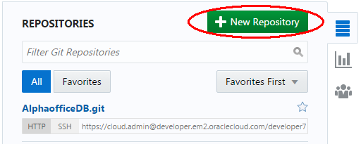

- New Repository entry popup - name box should have red border

    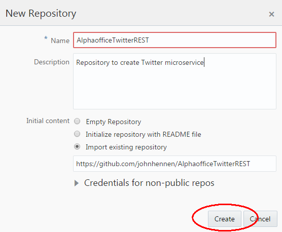

- Repository showing code files

    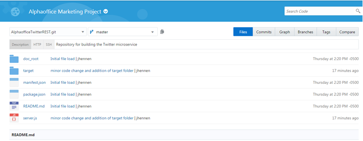

- STEP 3

- Build menu item - New Job button - Build menu item and new job button should be in red elipses

    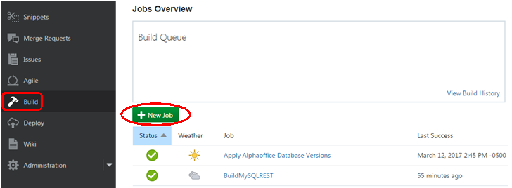

- New Job popup with job name and create a free-style job radio button

    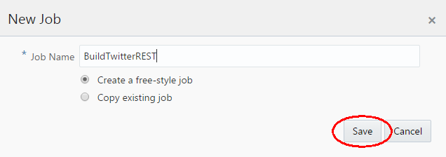

- build job configuration popup main tab

    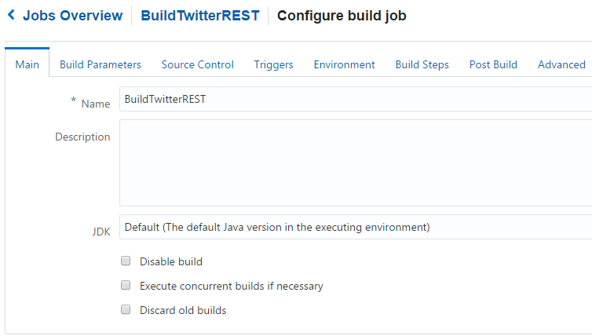

- build job configuration popup source control tab

    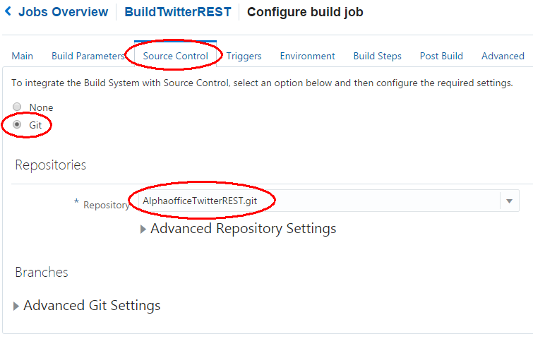

- build job configuration popup triggers tab

    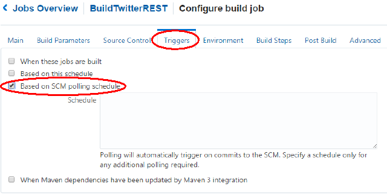

- build job configuration popup build steps tab and build-steps drop down

    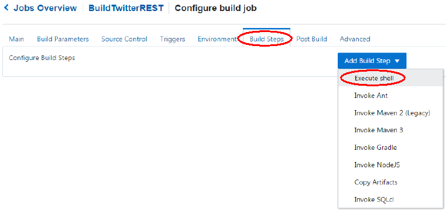

- build job configuration popup build steps tab - npm install

    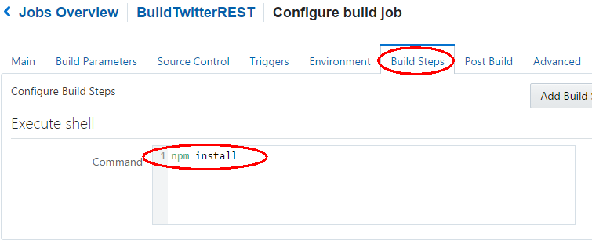

- build job configuration popup post build tab 

    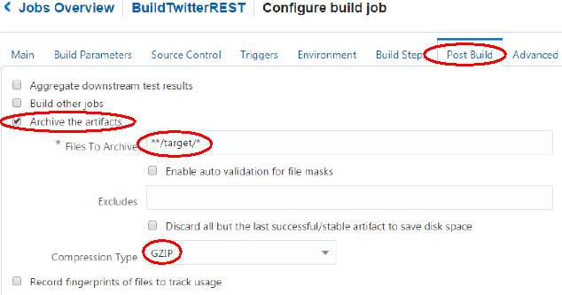

- build job working or in queue 

    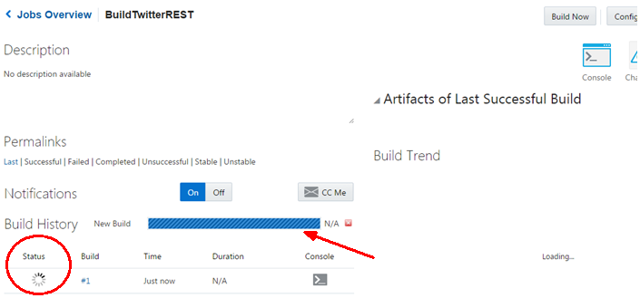

- build job built

    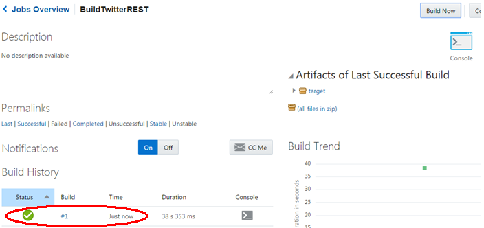

STEP 4

- Pick Deploy in Menu and New Configuration button - both should have red circles

    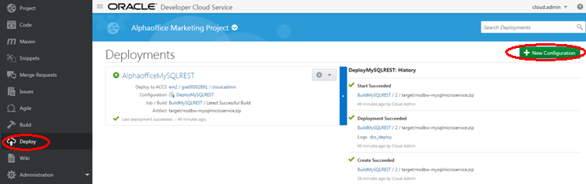

- New configuration popup - drop down with red circle around application container cloud

    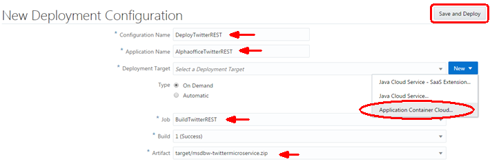

- Enter data center username password - test connection

    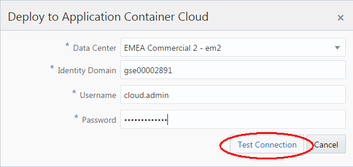

- Enter data center username password - use connection

    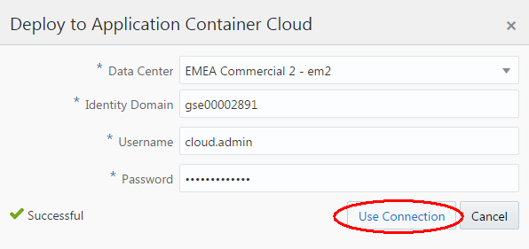

- configuration popup - make sure select Node instead of java

    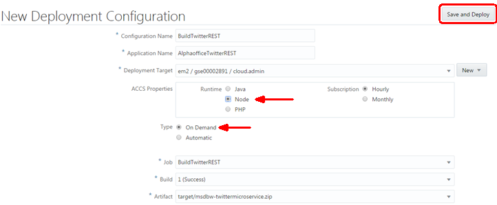

- Will show deploy in process then deploy completed

    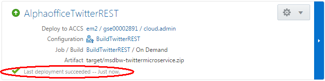

- If arrow is not green, but is orange and pointed down, then need to manually start

    

- To manually start, stop or redeploy, go to the gear dropdown icon

    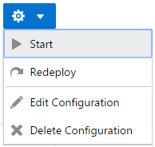

