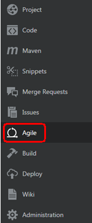
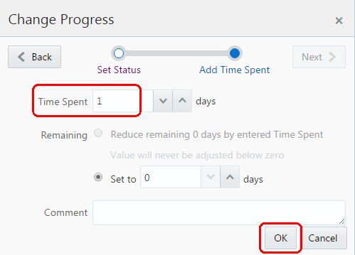

- Top image 

      

Update: January 28, 2017

# Introduction

This is the second of several labs that are part of the **Oracle Public Cloud DevOps Cloud Native Microservices workshop.** This workshop will walk you through the Software Development Lifecycle (SDLC) for a Cloud Native project that will create and use several Microservices.

In the first lab (100), the Project Manager created a new project in the Developer Cloud Service, added team members to the project, and created and assigned tasks to the developers of this application. In this lab, you will assume the persona of the Java developer, who will be tasked with creating several microservices that will supply data to any required front-end or analytics components (one of which you will build in the following lab, lab 300).

Please direct comments to: Dennis Foley (dennis.foley@oracle.com)

## Objectives

- Access Developer Cloud Service
- Import Code from external Git Repository
- Import Project into Eclipse
- Build and Deploy project using Developer Cloud Service and Oracle Application Container Cloud Service

## Required Artifacts

- The following lab requires an Oracle Public Cloud account that will be supplied by your instructor. You will need to download and install latest version of Eclipse

# Create Initial Static Twitter Feed Service

## Explore Developer Cloud Service

### **STEP 1**: Login to your Oracle Cloud account as Bala.Gupta

- DCS console before choosing Agile menu item

      

- John Dunbar

     

- Agile menu choice

      

- active sprints Swim lanes - all 4 sprints in to do

    

- Drag and drop create microsystems repositories to in progress -should have red arrow

    

- Confirm change - click next

    

- Confirm change - click ok

    

- swim lane after change

    

### **STEP 2**: 

- New Repository button

    

- New Repository entry popup - name box should have red border

    

- Repository showing code files

    

### **STEP 3**: 

- Build menu item - New Job button - Build menu item and new job button should be in red elipses

    

- New Job popup with job name and create a free-style job radio button

    

- build job configuration popup main tab

    

- build job configuration popup source control tab

    

- build job configuration popup triggers tab

    

- build job configuration popup build steps tab and build-steps drop down

    

- build job configuration popup build steps tab - npm install

    

- build job configuration popup post build tab 

    

- build job working or in queue 

    

- build job built

    

### **STEP 4**: 

- Pick Deploy in Menu and New Configuration button - both should have red circles

    

- New configuration popup - drop down with red circle around application container cloud

    

- Enter data center username password - test connection

    

- Enter data center username password - use connection

    

- configuration popup - make sure select Node instead of java

    

- Will show deploy in process then deploy completed

    

- If arrow is not green, but is orange and pointed down, then need to manually start

    

- To manually start, stop or redeploy, go to the gear dropdown icon

    

### **STEP 5**: 

- Drag and drop task 3 to verify code - need red arrow
- This should be delayed until repository is created for second microservice 

    

  ***NOTE***:

- Click next

    

  **NOTE**:

- Enter 1 days and click OK

    

Just plain paragraph here

- Moved to Verify code

    

