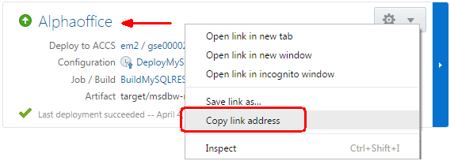

- STEP 6

- Right click to get the app url

     

- Test the mysql cloud app url in any browser

      

- STEP 7

- Drag and drop task 3 from verify code to completed

      

- Click next

      

- Enter one day and click ok

      

- Task 3 completed

      

- STEP 8

- Drag and drop feature 4 from to do to in progress

      

- Click next

      

- Enter one day and click ok

     

- STEP 9

- Click the brackets icon

    

- Open brackets folder

    

- Open brackets folder

    
- Brackets open to right folder

    

- STEP 10

- Click git icon to make sure panel is open

    

- Git panel open with red circle around clone

    

- Get DCS git url for mysql 

    

- Clone panel open enter info and click ok

     

- Cloning in process

    

- Cloning complete

    

- STEP 11

- Start terminal process

    

- Start the node module

    

- Test local with localhost

    

- STEP 12

- Click on Server.js and look at edit. Look at connect info - should be red circles

    

- Look at section to uncomment

    

- Uncomment

    

- Click save

    

- STEP 13

- Start terminal process

    

- Restart node

    

- Test edit with localhost

    

- STEP 14

- Click on master branch and then  create branch

    

- Enter branch name

    

- Click git icon to make sure panel showing

    

- Click server.js and click commit

    

- Enter comment for commit

    

- May need to enter git username

    

- May need to enter git email

- STEP 15

- Git push icon

    

- Enter cloud.admin username and password

    

- Successful push

    
