 - STEP 16

- DCS agile move task create rest services from in progress to verify code

    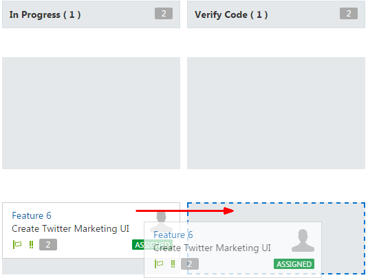  

- Click next

    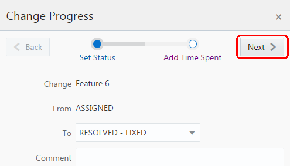

- Click ok

     

- STEP 17

- DCS choose right git

    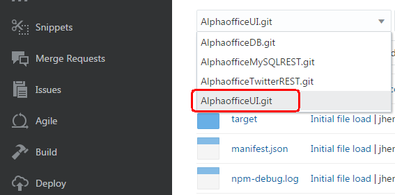 

- DCS choose right branch

    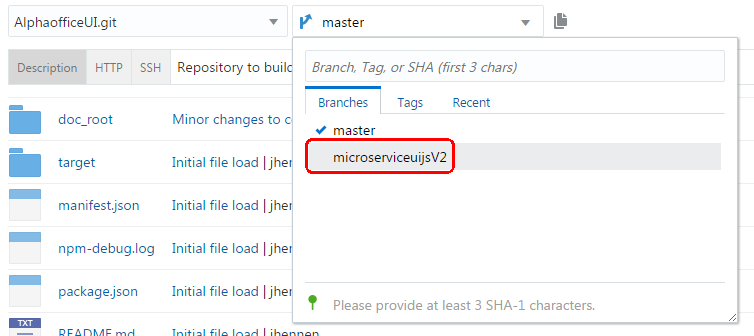 

- Choose commits - shows recent commit

    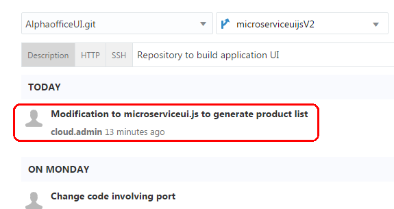

- Gupta and Lisa

    

- Click new merge request

    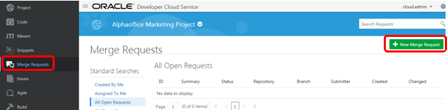

- New merge request popup 1

    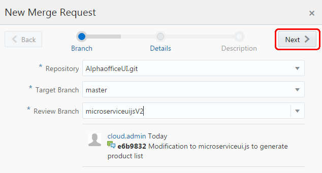

- New merge request popup 2

    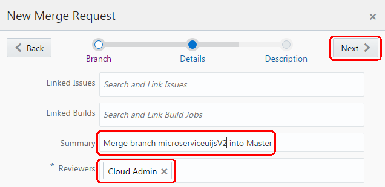

- New merge request popup 3 choose create

    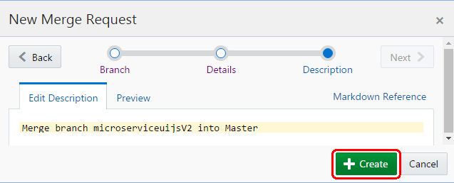

- STEP 18

- Lisa

    

- Agile menu choice

    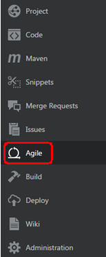

- As Lisa look at merge requests assigned to me

    

- Review code and click merge

    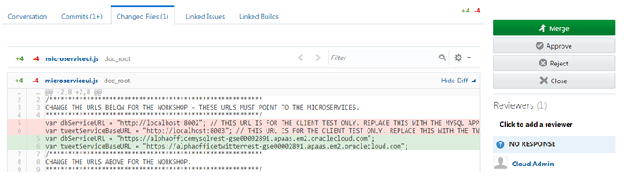

- Click merge

    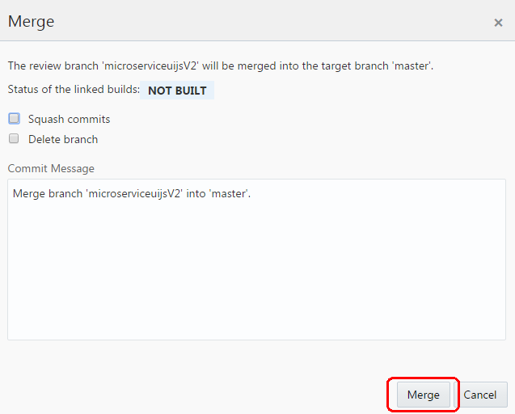

- Rebuild in queue

    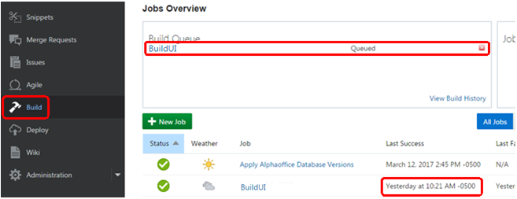

- Rebuild started

    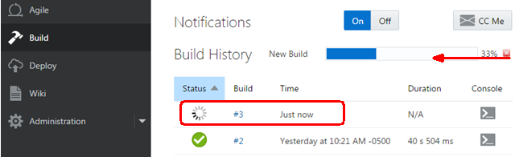

- Rebuild complete

    

- Will show redeploy in process then redeploy completed

    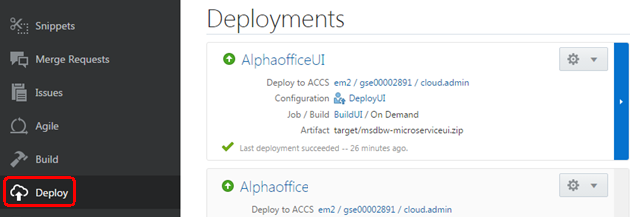

- If arrow is not green, but is orange and pointed down, then need to manually start

    

- To manually start, stop or redeploy, go to the gear dropdown icon

    

- STEP 19

- Right click to get application URL

    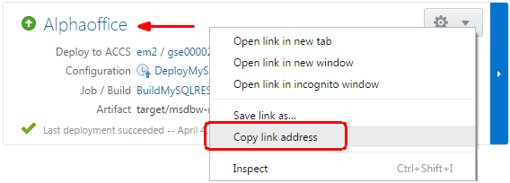

- Right click to get application URL

    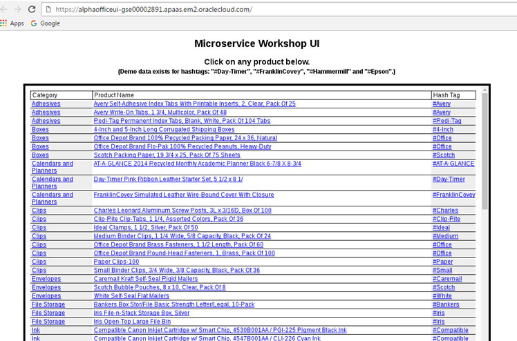

- STEP 20

- Click agile menu choice

    

- Agile move create rest services to completed

    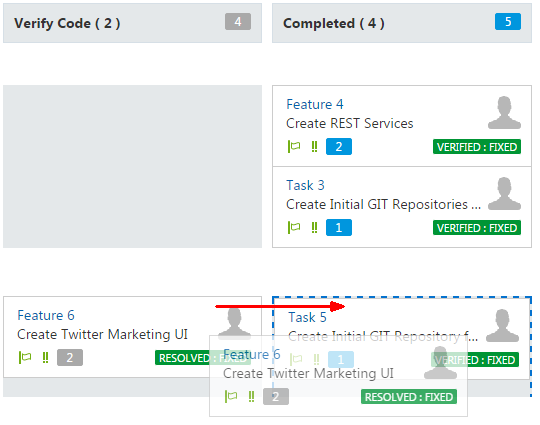

- Click next

    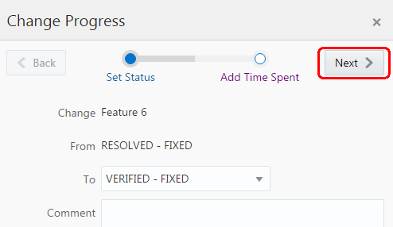

- Click OK

    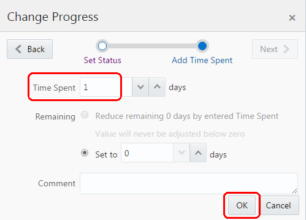

- Rest services completed

    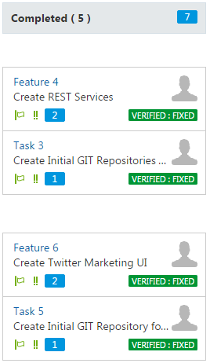
